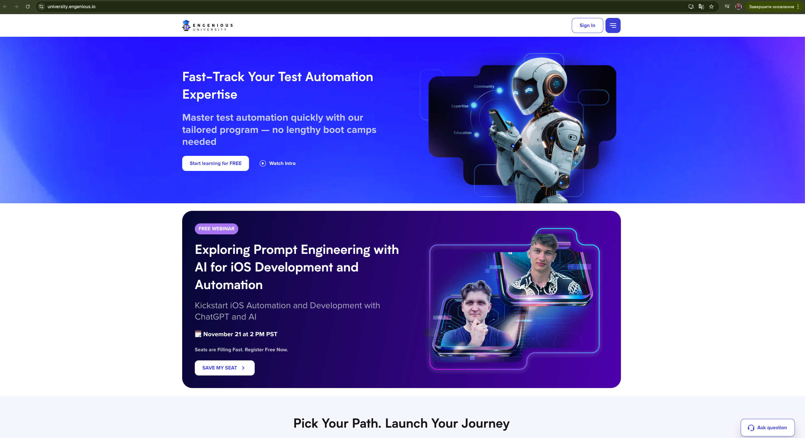
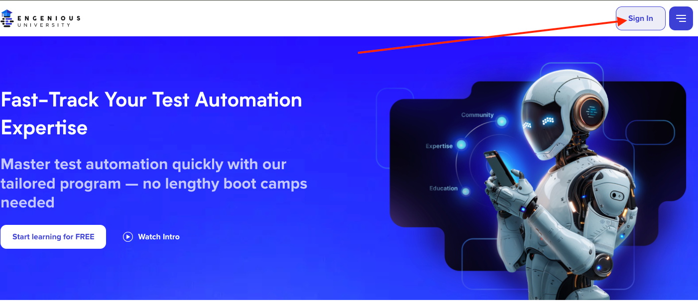
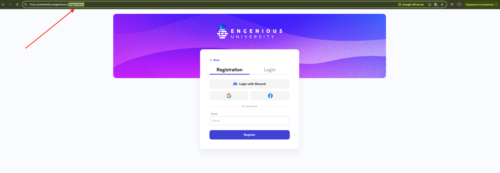
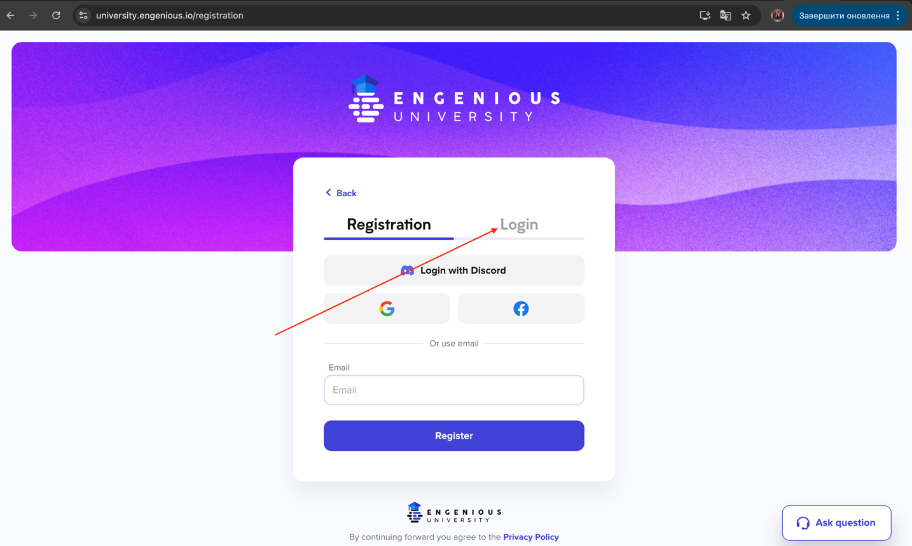
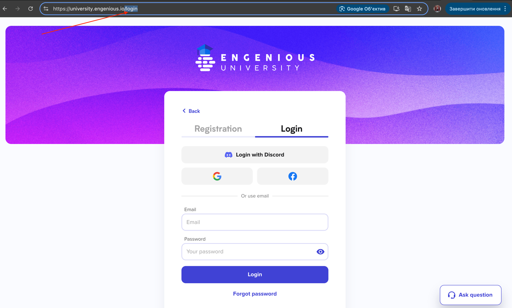
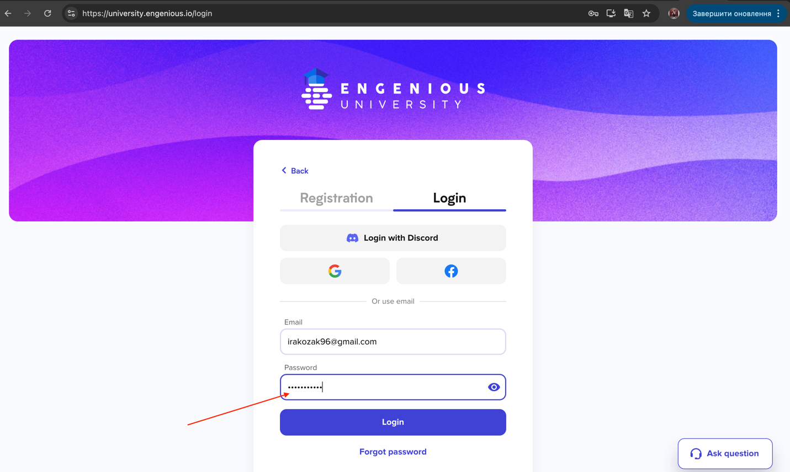
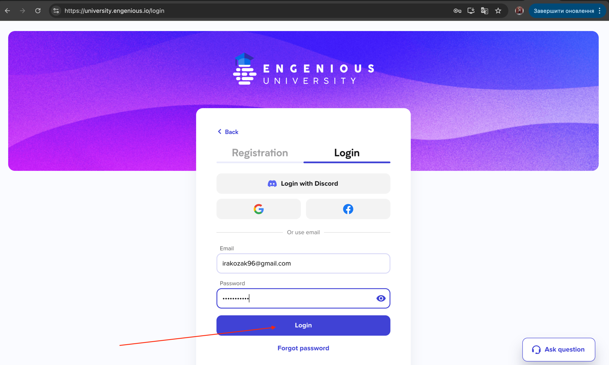
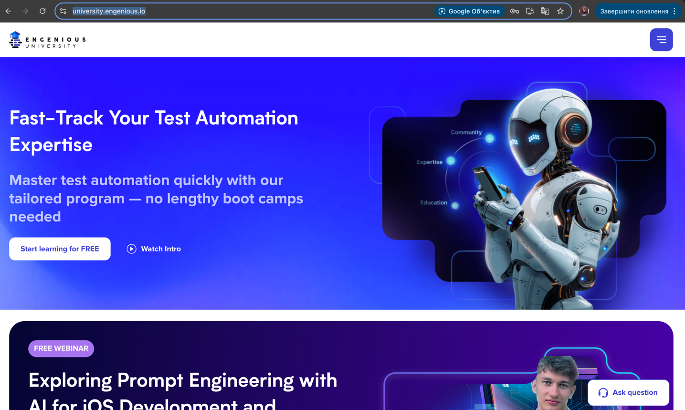

### Test Case ID: TC01
#### Title: Verify successful login with valid user's email and password
#### Priority: P0
#### Preconditions:  
The user is already registered with the following login credentials:  
email:"irakozak96@gmail.com", password: "Password123"
#### Steps:
1. Navigate to https://university.engenious.io/  
__ER:__ User is redirected to the university's homepage  

2. Click 'Sign In' button in the header  

__ER:__ User is redirected to '/registration' page  

3. Click Login button  

__ER:__ User is redirected to '/login' page  

4. Fill 'Email' field with 'irakozak96@gmail.com'  

__ER:__ 'Email' field is filled with 'irakozak96@gmail.com' value
5. Fill 'Password' field with 'Password123'  
 
__ER:__ 'Password' field is filled with 'Password123' value and the entered characters are displayed as hidden (represented by dots)
6. Click 'Login' button  

__ER:__ User is redirected to welcome page

